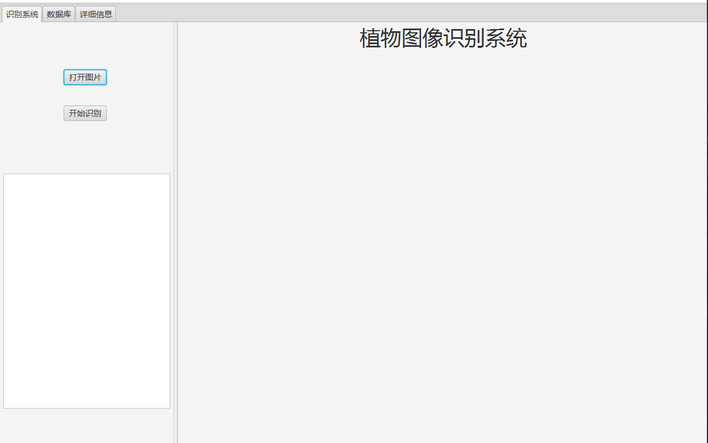
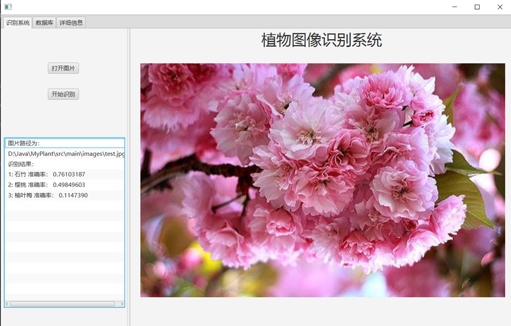
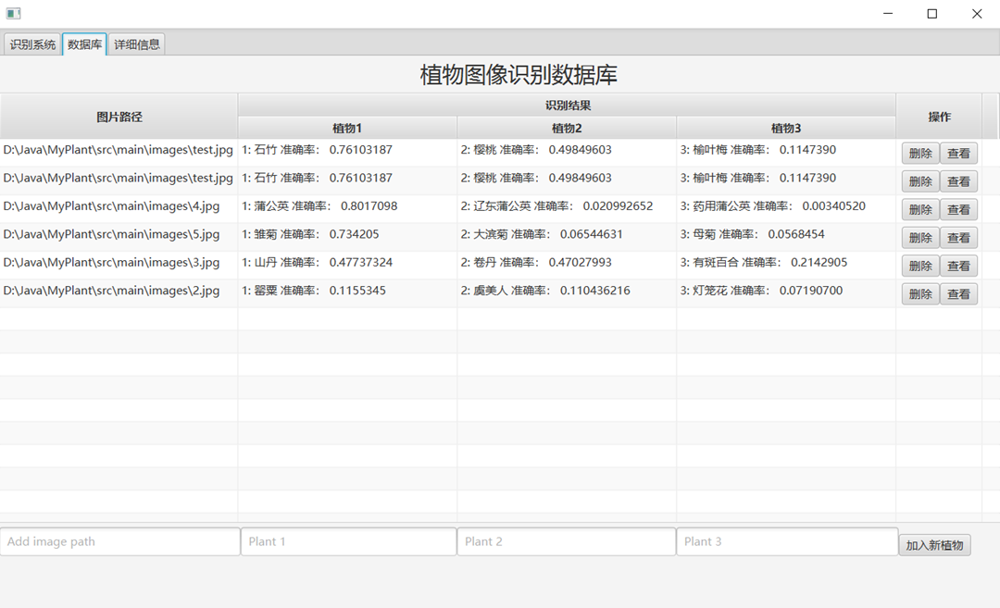
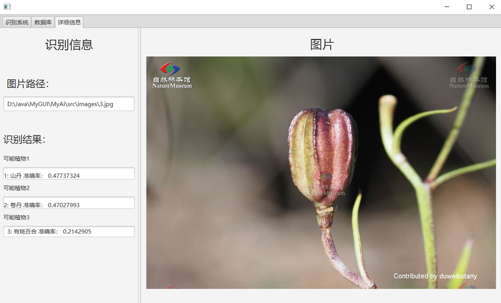

# MyPlantRecognition —— 基于百度API的植物图像识别GUI程序

本项目为**基于JAVAFX的植物图像识别系统**

## 使用流程

在Main类中打开，出现如下界面：



### 植物图像识别

点击打开图片，从本地选择图片，并显示在右侧。点击开始识别，将识别结果输出在左侧表格中，如下图：



### 查询识别结果

点击左上角数据库标签，切换至数据库界面，能够查询历史识别记录，如下图：



具有以下功能：

- **编辑**：双击条目，实现编辑功能。

- **删除**：点击相应条目的右侧删除按钮，实现删除操作。

- **添加条目**：在下方文本框中分别输入相应数据，点击```add```按钮实现增加条目功能。

- **查看详细信息：**点击右侧查看按钮，界面切换至详细信息页，如下图：

  

